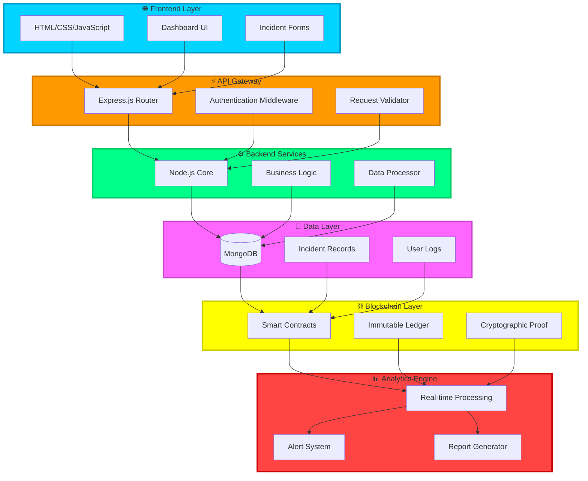
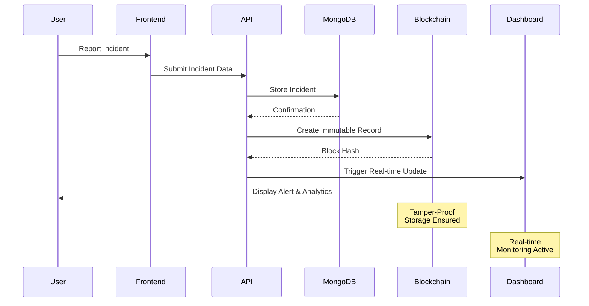
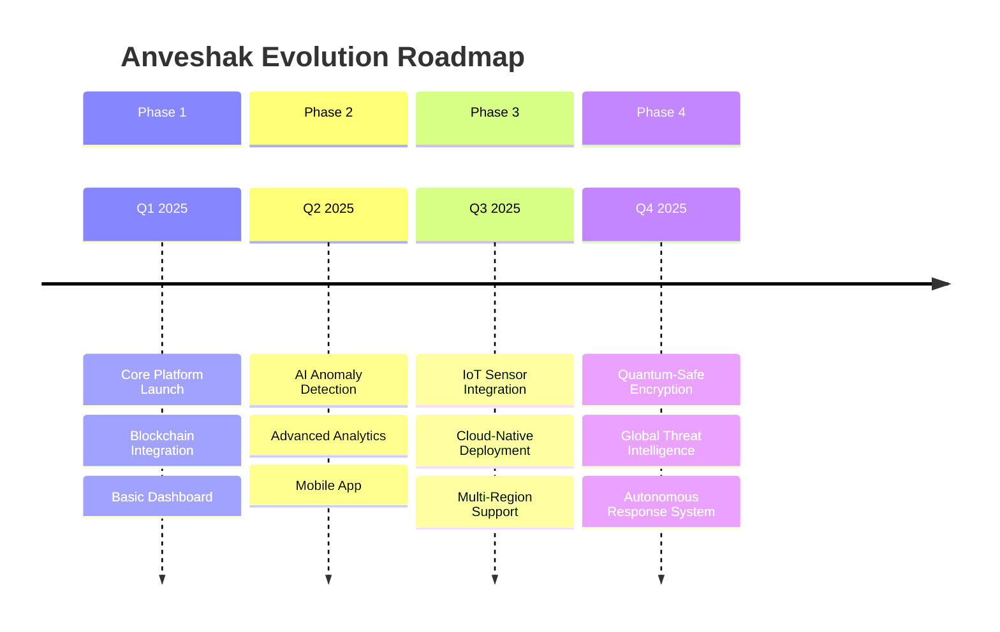

<div align="center">

# 🔍 Anveshak


### 🛡️ *Real-Time Threat Detection for Nation's Critical Security*

[](https://nodejs.org/)
[](https://www.mongodb.com/)
[](https://blockchain.com/)
[](https://expressjs.com/)


**Developed by Team BruteForce Coders 🇮🇳**

[🚀 Get Started](#-quick-start) • [📖 Documentation](#-about-the-project) • [🎯 Features](#-key-features) • [🏗️ Architecture](#️-system-architecture)

</div>

---

## 📖 About the Project


**Anveshak** (*Sanskrit: अन्वेषक* - meaning *Explorer/Detector*) is a cutting-edge **cybersecurity platform** engineered for **real-time threat detection** in:

- 🏭 **Nuclear Plants**
- 🎖️ **Defense Systems** 
- 🏛️ **Critical Infrastructure**

Our platform ensures **secure monitoring**, **transparent incident tracking**, and **tamper-proof storage** through the powerful combination of **Blockchain technology** and **AI-driven analytics**.

> 🏆 Built for **Smart India Hackathon (SIH) 2025**

<br clear="right"/>

---

## 🚨 The Problem

<div align="center">

```ascii
╔══════════════════════════════════════════════════════════════╗
║           ⚠️  CRITICAL INFRASTRUCTURE UNDER SIEGE            ║
╠══════════════════════════════════════════════════════════════╣
║                                                              ║
║  🦠  Malware Injections & Ransomware Attacks                ║
║  🔑  Insider Threats & Unauthorized Access                  ║
║  📝  Tampered or Deleted System Logs                        ║
║  ⏱️  Delayed Detection & Response Times                     ║
║  🔓  Weak Log Integrity Systems                             ║
║  🎯  No Unified Monitoring System                           ║
║                                                              ║
╚══════════════════════════════════════════════════════════════╝
```

</div>

Cyber threats to **critical infrastructure** are escalating at an alarming rate. Traditional security systems fail due to fragmented monitoring, poor log integrity, and lack of real-time response capabilities.

---

## ✅ Our Solution

<div align="center">

</div>

**Anveshak** provides a **unified security ecosystem** that bridges the gap between threat detection and response:

<table>
<tr>
<td width="50%">

### 🎯 Core Capabilities
- 🔹 **Real-time Incident Monitoring**
- 🔹 **Live Dashboard & Analytics**
- 🔹 **Blockchain-backed Logs** 🔒
- 🔹 **Automated Alerts & Notifications**

</td>
<td width="50%">

### 🚀 Key Benefits
- ⚡ **Instant Threat Detection**
- 📊 **Data-Driven Insights**
- 🛡️ **Tamper-Proof Security**
- 🌐 **Multi-Agency Scalability**

</td>
</tr>
</table>

---

## 🌟 Key Features

<div align="center">

| Feature | Description |
|---------|-------------|
| 📝 **Incident Reporting** | Securely log anomalies, intrusions, or threats with timestamp verification |
| 📊 **Admin Dashboard** | Interactive charts, real-time updates & comprehensive analytics |
| ⛓️ **Blockchain Integration** | Immutable, verifiable incident storage with cryptographic proof |
| 👥 **Role-based Access Control** | Granular permissions for Admins, Operators & Analysts |
| 🕵️ **Forensic Analysis** | Complete historical traceability for security audits |
| 🔔 **Smart Notifications** | Automated alerts via multiple channels |
| 📈 **Predictive Analytics** | AI-powered threat pattern recognition |

</div>

<div align="center">

</div>

---

## 🏗️ System Architecture



---

## 💻 Tech Stack

<div align="center">

### 🌐 Frontend Technologies


**Clean UI/UX with dynamic dashboards, interactive charts, and real-time incident logs**

### ⚙️ Backend Technologies


**RESTful APIs with MongoDB for incident & log storage**

### 🔗 Blockchain Layer


</div>

<details>
<summary><b>🔒 Why Blockchain? Click to expand</b></summary>

<br>

| Advantage | Benefit |
|-----------|---------|
| ⛓️ **Tamper-proof Logs** | No unauthorized modifications possible |
| 🔑 **Decentralized Trust** | Ensures transparency across agencies |
| 🛡️ **Audit-friendly** | Easy verification during cyber audits |
| 📜 **Immutable Records** | Complete historical integrity |
| 🔐 **Cryptographic Security** | Military-grade protection |

</details>

---

## 📂 Project Structure

```
Anveshak/
│
├── 📁 backend/                     # Server-side architecture
│   ├── 🚀 server.js                # Application entry point
│   ├── 🔐 .env                     # Environment configuration
│   │
│   ├── 📁 models/                  # Database schemas
│   │   ├── Incident.js             # Incident data model
│   │   └── Log.js                  # Activity log model
│   │
│   ├── 📁 utils/                   # Utility modules
│   │   └── db.js                   # Database & blockchain helpers
│   │
│   └── 📁 routes/                  # API endpoints
│       ├── incidents.js            # Incident management APIs
│       └── logs.js                 # Log retrieval APIs
│
├── 📁 frontend/                    # Client-side interface
│   ├── 🏠 block.html               # Blockchain visualization
│   ├── 📊 dashboard.html           # Main analytics dashboard
│   ├── 🔑 login.html               # Authentication page
│   ├── ➕ addincident.html         # Incident submission form
│   ├── 📄 surces.html              # Resource management
│   ├── 📋 incidents.html           # Incident list view
│   ├── 📝 logs.html                # Activity logs viewer
│   │
│   └── 📁 assets/                  # Static resources
│       ├── 🎨 CSS files
│       ├── ⚡ JavaScript modules
│       └── 🖼️ Images & icons
│
└── 📖 README.md                    # You are here!
```

---

## ⚡ Quick Start

<div align="center">

</div>

### 1️⃣ Clone the Repository

```bash
git clone https://github.com/your-username/anveshak.git
cd anveshak
```

### 2️⃣ Setup Backend

```bash
cd backend
npm install
```

### 3️⃣ Configure Environment

Create a `.env` file in the `backend` directory:

```env
PORT=5000
MONGO_URI=your_mongodb_connection_string
PRIVATE_KEY=your_blockchain_private_key
```

### 4️⃣ Run Backend Server

```bash
# Standard mode
node server.js

# Development mode (with auto-reload)
nodemon server.js
```

### 5️⃣ Launch Frontend

Open any of the following pages in your browser 🌍:

```
frontend/login.html        → Authentication
frontend/dashboard.html    → Main Dashboard
frontend/addincident.html  → Report Incidents
frontend/incidents.html    → View All Incidents
frontend/logs.html         → System Logs
frontend/block.html        → Blockchain Viewer
frontend/surces.html       → Resources
```

<div align="center">

**🎉 You're all set! Anveshak is now running locally.**

</div>

---

## 📊 How Anveshak Works

<div align="center">



</div>

### 🔄 Workflow

1. 🚦 **Incident Reported** → Securely stored in **MongoDB**
2. ⛓️ **Blockchain Validation** → Creates immutable cryptographic record
3. 📡 **Dashboard Update** → Real-time analytics and alerts displayed
4. 🛠️ **Admin Action** → Role-based threat management and response

---

## 📈 SWOT Analysis

<div align="center">

<table>
<tr>
<td width="50%" valign="top">

### 💪 Strengths
- ✅ Real-time threat detection
- ✅ Blockchain security
- ✅ Scalable architecture
- ✅ User-friendly interface
- ✅ Multi-agency support

</td>
<td width="50%" valign="top">

### 🎯 Opportunities
- 🌟 AI/ML integration
- 🌟 IoT sensor networks
- 🌟 Cloud deployment
- 🌟 Global threat sharing
- 🌟 Predictive analytics

</td>
</tr>
<tr>
<td width="50%" valign="top">

### ⚠️ Weaknesses
- 🔸 Initial setup complexity
- 🔸 Blockchain latency
- 🔸 Resource requirements
- 🔸 Learning curve

</td>
<td width="50%" valign="top">

### 🛡️ Threats
- 🔸 Advanced persistent threats
- 🔸 Zero-day vulnerabilities
- 🔸 Quantum computing risks
- 🔸 Social engineering

</td>
</tr>
</table>

</div>

---

## 🚀 Future Roadmap

<div align="center">



</div>

### 🎯 Upcoming Features

- 🤖 **AI-Powered Anomaly Detection** - Machine learning models for predictive threat analysis
- 📡 **IoT Sensor Integration** - Direct monitoring of physical infrastructure
- ☁️ **Cloud-Native Deployment** - Kubernetes orchestration and auto-scaling
- 🔍 **Threat Intelligence Network** - Collaborative multi-agency threat sharing
- 🎮 **Interactive Simulations** - Security training and response drills
- 📱 **Mobile Applications** - iOS and Android native apps

---

## 🏆 Acknowledgements

<div align="center">


### Built for Smart India Hackathon 2025 🇮🇳

**Team BruteForce Coders**


---

### 🌟 If you find Anveshak useful, please consider giving it a ⭐!

[](https://github.com/your-username/anveshak/stargazers)
[](https://github.com/your-username/anveshak/network/members)

---

**Made with ❤️ by BruteForce Coders for a Secure India**


</div>

---

<div align="center">

### 📬 Connect With Us

[](https://linkedin.com)
[](https://github.com)
[](mailto:team@anveshak.dev)

**© 2025 Anveshak | Securing Tomorrow's Critical Infrastructure Today**

</div>
